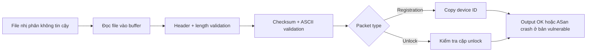
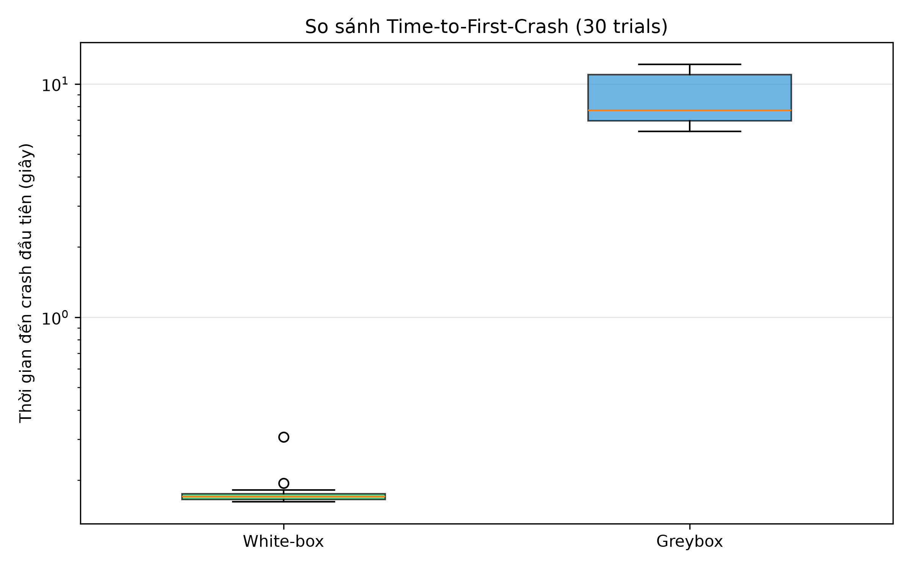
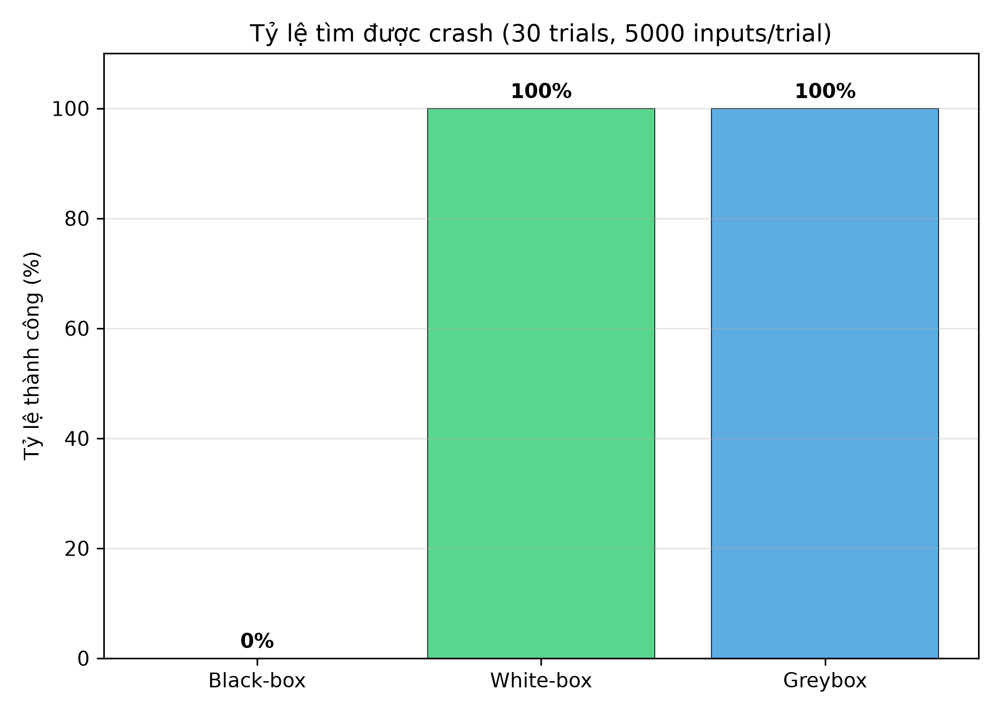
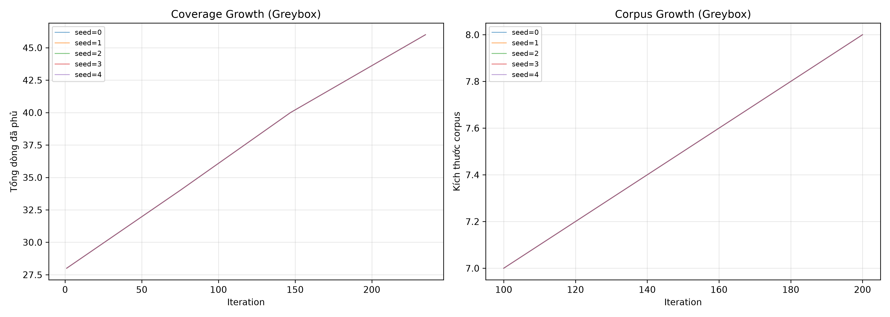
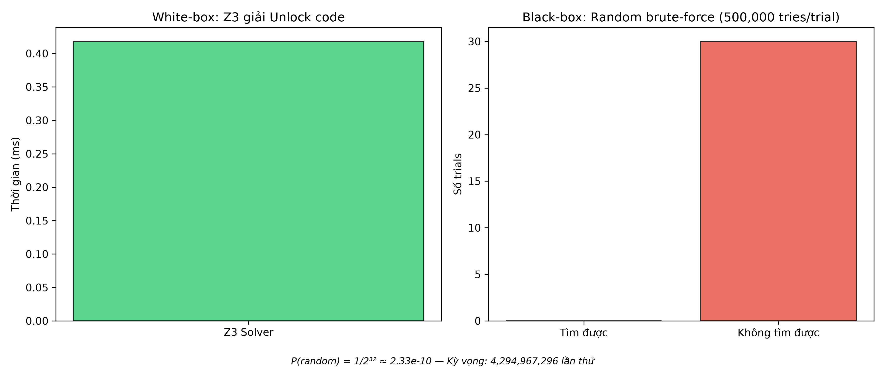

# BÁO CÁO BÀI TẬP LỚN
## Đề tài 4: Kiểm thử mờ (Fuzzing) — SecureGate Binary Parser

**Học phần:** CSE703093 — An toàn phần mềm
**Nhóm 11:**

| Họ và tên | MSSV | Lớp |
|---|---|---|
| Lưu Đức Hiệp | *(placeholder)* | *(placeholder)* |
| Hà Nguyễn Trúc Linh | *(placeholder)* | *(placeholder)* |

**Ngày nộp:** *(placeholder)*

> **Ghi chú:** Lỗi CWE-121 trong chương trình mục tiêu được cài đặt **chủ đích** nhằm phục vụ mục đích học tập và so sánh phương pháp fuzzing.

---

## 1. Giới thiệu và Mục tiêu

### 1.1 Bối cảnh

Các thiết bị IoT gateway thường sử dụng giao thức nhị phân tuỳ chỉnh để trao đổi dữ liệu. Parser xử lý gói tin là thành phần có attack surface lớn: nó phải phân tích dữ liệu không đáng tin cậy từ mạng, thường viết bằng C/C++ — ngôn ngữ dễ mắc lỗi an toàn bộ nhớ. Một lỗi tràn bộ đệm trong parser có thể bị khai thác để thực thi mã tuỳ ý (RCE).

Kiểm thử mờ (fuzzing) là kỹ thuật tự động sinh đầu vào để tìm lỗi phần mềm. Tuỳ mức thông tin về chương trình mục tiêu, fuzzing chia thành:
- **Hộp đen (black-box):** không biết mã nguồn, không phản hồi coverage.
- **Hộp xám (greybox):** dùng phản hồi coverage để dẫn dắt tìm kiếm.
- **Hộp trắng (white-box):** dùng phân tích chương trình và SMT solver để sinh đầu vào vượt qua mọi rào cản.

### 1.2 Mục tiêu

1. Thiết kế chương trình mục tiêu (target) là parser gói nhị phân SecureGate IoT Gateway, có lỗi CWE-121 (Stack-based Buffer Overflow) cài chủ đích.
2. Áp dụng **Chương 2** (static analysis, sanitizer, vá lỗi) để phát hiện và sửa lỗi.
3. Áp dụng **Chương 4** (fuzzing) với ba chiến lược: black-box, greybox và white-box.
4. **So sánh định lượng** black-box vs white-box trong việc tìm crash CWE-121 (benchmark chính).
5. Phân tích bổ sung: greybox coverage growth và benchmark unlock code (bài toán cô lập 32-bit).

### 1.3 Phạm vi

Phạm vi gồm đúng một parser C tự viết nhận **một đường dẫn file nhị phân**, hai biến thể vulnerable/fixed, và ba chiến lược sinh input. Phân tích tập trung vào một lỗi CWE-121 có chủ đích, validation của giao thức và hiệu quả tìm đường đến lỗi. Dự án không đánh giá khả năng khai thác RCE, không fuzz network service thực, không đo hiệu năng AFL/libFuzzer, và không tuyên bố fuzzing chứng minh parser an toàn tuyệt đối.

---

## 2. Mô tả chương trình mục tiêu

### 2.1 Giao thức SecureGate

Parser nhận một file nhị phân chứa một gói tin tuân theo giao thức SecureGate IoT Gateway:

**Header 16 byte (little-endian):**

| Offset | Trường | Kiểu | Giá trị hợp lệ |
|:---:|---|---|---|
| 0–3 | `magic` | `char[4]` | `"IGW1"` (`0x49 0x47 0x57 0x31`) |
| 4 | `version` | `u8` | `1` |
| 5 | `type` | `u8` | `0x01` (Registration) hoặc `0x02` (Unlock) |
| 6 | `device_id_len` | `u8` | `0..32` (vulnerable) / `0..16` (fixed) |
| 7 | `flags` | `u8` | `0` |
| 8–9 | `payload_len` | `u16 LE` | ≥ `device_id_len` nếu Registration |
| 10–11 | `unlock_a` | `u16 LE` | `7421` nếu Unlock |
| 12–13 | `unlock_b` | `u16 LE` | `3390` nếu Unlock |
| 14–15 | `reserved` | `u16 LE` | `0` |

Sau header: `payload_len` byte payload + `checksum:u32 LE` (tổng byte header+payload mod 2³²).

### 2.2 Luồng dữ liệu, attack surface và độ phức tạp



Attack surface duy nhất là bytes của file đầu vào: magic, các trường length, payload, checksum và hai trường unlock đều do bên ngoài kiểm soát. Target gồm khoảng 286 LOC C và 5 hàm chính (`compute_checksum`, `read_le16`, `read_le32`, `is_ascii_printable`, `main`), nằm trong phạm vi nhỏ đủ để hiểu toàn bộ luồng nhưng vẫn có nhiều validation gate trước điểm lỗi.

### 2.3 Chuỗi validation

Parser kiểm tra tuần tự: magic → version → type → flags → reserved → kích thước file → `payload_len >= device_id_len` → checksum → ASCII device_id. Gói bị reject tại bất kỳ bước nào sẽ dừng xử lý ngay.

### 2.4 Attack surface và lỗi CWE-121

**Bản vulnerable:** `device_id_len` cho phép tới 32 nhưng `char device_id[16]` trên stack → `memcpy(device_id, payload, hdr.device_id_len)` ghi tràn khi `device_id_len > 16`.

```c
/* === BAN VULNERABLE: CWE-121 === */
char device_id[16];  /* !!! QUA NHO cho device_id_len > 16 !!! */
memcpy(device_id, payload, hdr.device_id_len);  /* !!! CWE-121 !!! */
```

**Bản fixed:** reject `device_id_len > 16`, buffer 17 byte, copy có giới hạn, NUL-terminate.

```c
/* === BAN FIXED === */
if (hdr.device_id_len > 16) {
    fprintf(stderr, "[REJECT] device_id_len qua lon: %u > 16\n", hdr.device_id_len);
    return 1;
}
char device_id[17];
memcpy(device_id, payload, hdr.device_id_len);
device_id[hdr.device_id_len] = '\0';
```

### 2.5 Rào cản fuzzing

Để trigger CWE-121, input phải:
1. Khớp đúng magic `"IGW1"` (4 byte cố định) — xác suất random: $P = (1/256)^4 \approx 2.3 \times 10^{-10}$
2. Version = 1, type = 0x01, flags = 0, reserved = 0
3. `device_id_len` > 16 (nằm trong range 17..32)
4. Checksum hợp lệ
5. Device ID là ASCII printable

Rào cản magic byte là bài toán cốt lõi: black-box thuần tuý gần như không thể vượt qua trong ngân sách giới hạn.

---

## 3. Phương pháp Chương 2: Static Analysis và Sanitizer

### 3.1 Cppcheck

Chạy Cppcheck trên mã nguồn target:

```bash
cppcheck --enable=all --inconclusive --std=c11 src/gateway_parser.c
```

Cppcheck không nhất thiết suy ra được `device_id_len` do input điều khiển trong bản demo; vì vậy kết quả “không có lỗi chắc chắn” không thay thế ASan. Cảnh báo/style và phiên bản lệnh chạy thực tế được lưu cùng dữ liệu nộp bài.

| Lệnh | Kết quả thực tế | Diễn giải |
|---|---|---|
| `make cppcheck` | Không có defect an toàn được kết luận | Cppcheck không xác nhận được overflow phụ thuộc input này. |
| Cảnh báo style | `argv` có thể khai báo const | Không ảnh hưởng logic parser hay CWE-121. |
| Information | `normalCheckLevelMaxBranches` | Giới hạn mức phân tích của Cppcheck, không phải lỗi target. |

### 3.2 AddressSanitizer (ASan)

Target được build với `-fsanitize=address,undefined` để phát hiện vi phạm bộ nhớ tại runtime. ASan đóng vai trò **crash oracle**: nếu parser crash với ASan báo `stack-buffer-overflow`, ta xác nhận đã tìm được lỗi CWE-121.

```bash
gcc -g -fsanitize=address,undefined --coverage -o parser_vuln gateway_parser.c
```

### 3.3 Vá lỗi và Regression Test

- Diff giữa bản vulnerable và fixed cho thấy chính xác bản vá.
- Crash input đã lưu được dùng làm regression test: chạy trên bản fixed phải bị reject (exit ≠ 0) mà **không** crash.

---

## 4. Phương pháp Chương 4: Fuzzing và Z3

### 4.1 Black-box Fuzzer (Chương 4.5)

**Tri thức:**
- **BIẾT:** cấu trúc giao thức công khai (header layout, length/checksum rules)
- **KHÔNG BIẾT:** magic `"IGW1"`, mã nguồn, coverage, cặp unlock

**Chiến lược:** Đây là benchmark có kiểm soát rào cản magic. Generator cố định version/type/flags/reserved, length/checksum hợp lệ và ID ASCII 24 byte — cùng crash profile đã công bố cho benchmark — rồi chỉ sinh magic 4 byte **ngẫu nhiên**. Nó không chứa `"IGW1"` trong dictionary hay seed, nhưng không cấm kết quả ngẫu nhiên trùng magic. Vì thế xác suất $2^{-32}$ bên dưới chính là xác suất vượt magic trong profile này, không phải xác suất của một parser fuzzer tổng quát.

### 4.2 White-box Fuzzer (Chương 4.6 + Z3 Chương 3)

Dùng Z3 (SMT solver) để **mã hoá thủ công các constraint của path đã đọc từ source** rồi dựng trực tiếp gói crash. Magic, version, type và `device_id_len=24` là các hằng số được đưa vào Python sau khi white-box đọc target; Z3 giải các byte payload ASCII và checksum phù hợp. Vì vậy đây là *solver-backed white-box packet construction*, không phải symbolic execution tự động khám phá hằng số trong binary.

```python
# Các hằng path đã biết sau khi đọc source:
magic = b"IGW1"; version = 1; pkt_type = 0x01; device_id_len = 24
# Z3 ràng buộc phần còn lại của packet:
s.add(payload[i] >= 0x41)      # ASCII uppercase
s.add(checksum == sum(header + payload) % 2**32)
```

Trên 30 lần lặp, thời gian Z3-only median là **0.0040 s** (min–max 0.0038–0.0216 s); median end-to-end đến ASan oracle là **0.1706 s**. Đây là repeated timing observations của cùng phương pháp dựng packet, không phải 30 khám phá ngẫu nhiên độc lập.

### 4.3 Greybox Fuzzer (Coverage-guided)

Workflow greybox dùng phản hồi coverage kiểu Lab 8 (gcov), không phải AFL:
1. Xoá `.gcda` → chạy target → `gcov` → đọc tập dòng cover
2. Nếu input mở coverage mới → thêm vào corpus queue
3. Mutate corpus: thay đổi 1–3 byte ngẫu nhiên, tính lại checksum

Để quan sát rào cản magic trong một target nhỏ, target cố ý tách guard magic theo từng byte; greybox thực hiện byte sweep xác định trên vùng magic của framing công khai và chỉ giữ prefix khi `gcov` mở dòng mới. Seed đã thỏa điều kiện ID 24 byte, và fuzzer không chứa giá trị `IGW1`. Vì thế đây chính xác là **deterministic coverage-observed prefix enumeration cho guard đã được tách**, không phải đo hiệu năng greybox mutation hay AFL/libFuzzer tổng quát. Greybox trình bày **riêng** — không đánh tráo với white-box trong so sánh chính.

### 4.4 Thiết kế thực nghiệm

| Tham số | Giá trị |
|---|---|
| Số trials mỗi fuzzer | 30 (seed 0..29) |
| Ngân sách mỗi trial | 5.000 inputs |
| Timeout mỗi input | 5 giây |
| Crash oracle | ASan `stack-buffer-overflow` có trace trỏ vào `gateway_parser.c` |
| Seed cố định | Để tái lập hoàn toàn |

**Metrics đo:**
- Trial-to-first-ASan-crash (iteration number)
- Wall-clock time (giây)
- Exec/s (chỉ là chi phí thực thi quan sát được; **không dùng để xếp hạng** black-box với white-box vì white-box chạy một packet đã dựng)
- Success rate (bao nhiêu trial tìm được crash)
- Unique crash signatures (deduplicate bằng ASan stack)

---

## 5. Kết quả và Phân tích

### 5.1 Bảng so sánh chính: Black-box vs White-box

Benchmark hoàn tất 30 trial/chiến lược với seed `0..29` và ngân sách tối đa 5.000 input/trial. Endpoint chính là **thành công tìm CWE-121 trong ngân sách** và wall-clock từ lúc bắt đầu đến ASan oracle; white-box dựng rồi chạy một packet, còn black-box dùng tối đa 5.000 packet. Vì vậy exec/s không phải metric so sánh hiệu quả thuật toán. `Time-to-crash` chỉ có ý nghĩa ở trial phát hiện crash; dấu `—` nghĩa là không trial nào phát hiện crash trong ngân sách đã thử.

| Metric | Black-box | White-box | Greybox (bổ sung) |
|---|:---:|:---:|:---:|
| Trials | 30 | 30 | 30 |
| Success rate | 0/30 (0%) | 30/30 (100%) | 30/30 (100%) |
| Unique ASan crash signatures | 0 | 1 | 1 |
| Time-to-crash median (s) | — | 0.1706 | 7.7011 |
| IQR time-to-crash (s) | — | [0.1654, 0.1755] | [6.9438, 11.0467] |
| Min–max time-to-crash (s) | — | 0.1619–0.3070 | 6.2665–12.1327 |
| Median exec/s | 50.95 | 5.85 | 36.95 |

Mặc dù 30 crash record xuất hiện trong từng nhóm white-box và greybox, chúng có cùng fault site `memcpy`/`gateway_parser.c`; địa chỉ ASLR được chuẩn hoá trước khi khử trùng lặp, nên tính là một CWE-121 duy nhất.

### 5.2 Biểu đồ

#### Time-to-First-Crash (Box plot)


#### Success Rate (Bar chart)


### 5.3 Phân tích Greybox

#### Coverage Growth
Greybox luôn đạt crash ở iteration 285, phủ 46 dòng và corpus cuối có 8 input trong 30 trial. Kết quả tất định này phản ánh chính xác prefix enumeration quan sát coverage trên four byte-wise guards ở §4.3, không phải hiệu năng mutation-guided fuzzing hay kết quả tổng quát của AFL/libFuzzer.



### 5.4 Benchmark phụ: Unlock Code

*(Bài toán cô lập rào cản 32-bit code — không phải kết quả crash chính.)*



- Z3 giải chính xác `(7421, 3390)` trong 0.418 ms và xác nhận một lần trên parser.
- Black-box random `unlock_a/unlock_b` là mô phỏng không gian ứng viên để đo xác suất, không chạy 500.000 process target mỗi trial.
- Với ngân sách 500.000 thử/trial, xác suất tìm được trong 1 trial là $1-(1-2^{-32})^{500000} \approx 1.16 \times 10^{-4}$; quan sát 0/30 trial thành công phù hợp với kỳ vọng này.

### 5.5 Crash Input và ASan Trace

Input đại diện từ white-box (44 byte):

```text
49 47 57 31 01 01 18 00 18 00 00 00 00 00 00 00
50 50 50 50 50 50 50 50 50 50 50 50 50 50 50 50
50 50 50 50 50 50 50 50 ca 08 00 00
```

ASan xác nhận lỗi tại phép copy trong parser vulnerable:

```text
ERROR: AddressSanitizer: stack-buffer-overflow
WRITE of size 24
#0 ... in memcpy
#1 ... in main src/gateway_parser.c:264
[96, 112) 'device_id' ... Memory access at offset 112 overflows this variable
```

### 5.6 Regression Test sau vá

```bash
# Crash input chạy trên bản fixed → REJECT, không crash
./parser_fixed crashes/whitebox_s0_crash_0.bin
# [REJECT] device_id_len qua lon: 24 > 16
```

---

## 6. Thảo luận và Hạn chế

### 6.1 Tại sao black-box thất bại?

Rào cản magic byte `"IGW1"`:
$$P(\text{random 4 byte} = \text{"IGW1"}) = \left(\frac{1}{256}\right)^4 \approx 2.3 \times 10^{-10}$$

Với ngân sách 5.000 thử/trial, kỳ vọng tìm được magic đúng: $5000 \times 2.3 \times 10^{-10} \approx 1.15 \times 10^{-6}$ — gần như bằng 0.

### 6.2 Tại sao white-box thành công?

Do constants của path đã được mã hoá thủ công từ source, solver dựng checksum/payload hợp lệ và chạy trực tiếp một candidate vượt qua guards. Kết quả minh hoạ lợi ích của thông tin white-box đối với rào cản magic, nhưng không chứng minh symbolic execution tự động có chi phí hằng số hay scale được với parser lớn.

### 6.3 Hạn chế

1. **Target đơn giản:** Parser chỉ có khoảng 280 dòng C, 1 bug chủ đích. Trong thực tế, parser phức tạp hơn nhiều.
2. **Path explosion:** White-box fuzzer mô hình hoá thủ công path predicate. Với chương trình lớn, path explosion khiến Z3 không scale.
3. **Greybox chậm do gcov:** `gcov` per-input tạo overhead I/O đáng kể; median quan sát là 36.95 exec/s trên máy thử nghiệm này. Fuzzer thực tế dùng compile-time instrumentation (AFL/libFuzzer) thường nhanh hơn đáng kể.
4. **Fuzzing không sound/complete:** Không tìm thấy crash ≠ không có bug. Tìm thấy crash chỉ chứng minh sự tồn tại của bug, không chứng minh an toàn.
5. **Chỉ 1 crash CWE-121:** Unique crash signature ít vì cùng 1 bug pattern.

---

## 7. Kết luận

| Fuzzer | Tìm crash CWE-121? | Lý do |
|---|:---:|---|
| Black-box | ✗ (0/30 trong ngân sách) | Rào cản magic byte $P \approx 10^{-10}$ |
| White-box | ✓ (luôn) | Hằng path mã hoá thủ công; Z3 dựng candidate hợp lệ |
| Greybox | ✓ (30/30) | `gcov` feedback giữ prefix mới trong byte sweep có kiểm soát |

**Kết luận:**
- White-box fuzzing (Z3) **vượt trội** black-box cho target có rào cản magic constant cố định.
- Greybox trong bài đạt target nhờ deterministic prefix enumeration quan sát coverage trên guard byte-wise có chủ đích; kết quả không đại diện cho AFL/libFuzzer.
- Static analysis (Cppcheck) và runtime sanitizer (ASan) là công cụ bổ trợ thiết yếu: Cppcheck cung cấp một lớp rà soát tĩnh nhưng không xác nhận được lỗi phụ thuộc input trong target này; ASan xác nhận crash tại runtime.
- Trong phạm vi một CWE-121 cài chủ đích, các công cụ bổ sung cho nhau ở mức minh hoạ; kết quả không chứng minh parser fixed an toàn tuyệt đối.

---

## Tài liệu tham khảo

1. Đề cương CSE703093 — An toàn phần mềm, Chương 2, 3, 4; tài liệu BTL_01 và BTL_02 do học phần cung cấp.
2. M. Zalewski, *American Fuzzy Lop (AFL) — Technical Whitepaper*, 2013, https://lcamtuf.coredump.cx/afl/technical_details.txt (truy cập 14/09/2026).
3. MITRE, *CWE-121: Stack-based Buffer Overflow*, https://cwe.mitre.org/data/definitions/121.html (truy cập 14/09/2026).
4. L. de Moura and N. Bjørner, "Z3: An Efficient SMT Solver", *TACAS 2008*, DOI: https://doi.org/10.1007/978-3-540-78800-3_24.
5. K. Serebryany et al., "AddressSanitizer: A Fast Address Sanity Checker", *USENIX ATC 2012*, https://www.usenix.org/conference/atc12/technical-sessions/presentation/serebryany.
6. Google, *OSS-Fuzz documentation*, https://google.github.io/oss-fuzz/ (truy cập 14/09/2026).
7. Tài liệu Lab 8 của học phần, `lab8_fuzzing/python/whitebox_fuzzer.py`: tham chiếu workflow `gcov` và fuzzer minh hoạ; implementation trong bài là bản tự viết, không import trực tiếp toolkit.

---

## Phụ lục

### A. Hướng dẫn tái tạo

```bash
cd BTL/
make vuln fixed        # Build target
make test              # Chạy test suite
make cppcheck          # Static analysis
make benchmark         # Chạy 30 trials × 3 fuzzer
python3 scripts/aggregate_results.py   # Tổng hợp
python3 scripts/generate_charts.py     # Biểu đồ
```

### B. Cấu trúc thư mục

```
BTL/
├── CONTEXT.md, ADR.md, README.md, Makefile
├── src/gateway_parser.c          # Target C parser
├── fuzzers/
│   ├── packet_builder.py         # Module xây gói dùng chung
│   ├── blackbox_fuzzer.py        # Fuzzer hộp đen
│   ├── whitebox_fuzzer.py        # Fuzzer hộp trắng (Z3)
│   ├── greybox_fuzzer.py         # Fuzzer greybox (gcov)
│   └── unlock_benchmark.py       # Benchmark unlock code
├── tests/test_parser.py, test_fuzzers.py
├── scripts/run_benchmark.py, aggregate_results.py, generate_charts.py
├── seed_corpus/, crashes/, data/raw/
└── report/BAO_CAO_BTL.md, figures/
```
